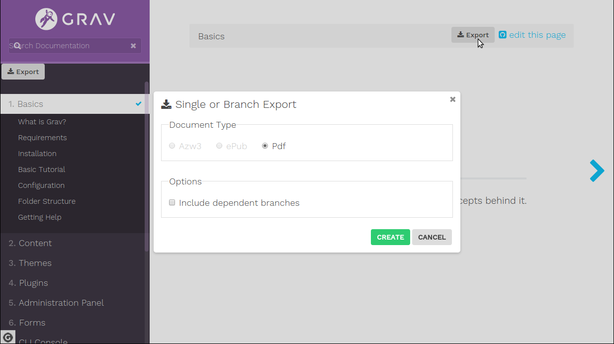
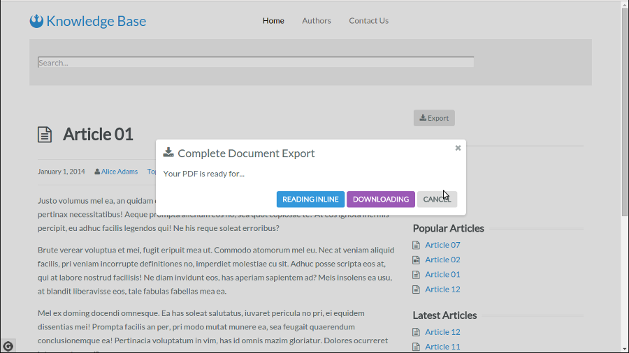

# Grav SnappyGrav Plugin

`snappygrav` is a simple [Grav](http://github.com/getgrav/grav) plugin that allows you to easily save a page in PDF format.

> NOTE: This plugin is a modular component for Grav which requires [Grav](http://github.com/getgrav/grav) to function.





# Installation

Installing the `SnappyGrav` plugin can be done in one of two ways. The GPM (Grav Package Manager) installation method enables you to quickly and easily install the plugin with a simple terminal command, while the manual method enables you to do so via a zip file.

## GPM Installation (Preferred)

The simplest way to install this plugin is via the [Grav Package Manager (GPM)](http://learn.getgrav.org/advanced/grav-gpm) through your system's Terminal (also called the command line).  From the root of your Grav install type:

    $ bin/gpm install snappygrav

This will install the `SnappyGrav` plugin into your `/user/plugins` directory within Grav. Its files can be found under `/your/site/grav/user/plugins/snappygrav`.

## Manual Installation

To install this plugin, just download the zip version of this repository and unzip it under `/your/site/grav/user/plugins`. Then, rename the folder to `snappygrav`. You can find these files either on [GitHub](https://github.com/iusvar/grav-plugin-snappygrav) or via [GetGrav.org](http://getgrav.org/downloads/plugins#extras).

You should now have all the plugin files under

    /your/site/grav/user/plugins/snappygrav

## Requirements

To work the plugin `snappygrav` use the following libraries:

* [KnpLabs Snappy](https://github.com/KnpLabs/snappy), the PHP5 library allowing thumbnail, snapshot or PDF generation from a url or a html page. The library Snappy is a product of [Matthieu Bontemps](https://github.com/mbontemps) of [KNP Labs](http://KNPLabs.ch), released under the MIT License.
* [Wkhtmltopdf](http://wkhtmltopdf.org/), the open source (LGPLv3) command line tools to render HTML into PDF (minimum version required 0.12.x). The Wkhtmltopdf project maintained by [Ashish Kulkarni](https://github.com/ashkulz), originally created by [Jakob Truelsen](https://github.com/antialize), released under open source License (LGPLv3).
* [jquery-confirm v3](https://craftpip.github.io/jquery-confirm/) library with changes.

> From version v1.3.1-rc.1 the first two libraries are already provided in the vendor folder (knplabs/knp-snappy and h4cc/wkhtmltopdf-i386). The latest library is provided by version 1.5.0.

However it is useful to know that ...

The simplest way to install `KnpLabs Snappy` and `Wkhtmltopdf` is via [Composer](http://getcomposer.org/). Regarding Snappy, place yourself in the Snappygrav plugin folder and type:

    $ composer require knplabs/knp-snappy

While for wkhtmltopdf, for i386, as follows:

    $ composer require h4cc/wkhtmltopdf-i386

For amd64 replace with wkhtmltopdf-amd64.

> Note: Binaries for Microsoft Windows, also installable with composer, can be found here: [github.com/wemersonjanuario/wkhtmltopdf-windows](https://github.com/wemersonjanuario/wkhtmltopdf-windows). Sorry unproved, I live in Ubuntu :-)

# Usage

For now the `snappygrav` plugin as been tested for three types of sites:

* [Blog Site](https://github.com/getgrav/grav-skeleton-blog-site) skeleton with [Antimatter](https://github.com/getgrav/grav-theme-antimatter) theme
* [RTFM Site](https://github.com/getgrav/grav-skeleton-rtfm-site) skeleton with [Learn2](https://github.com/getgrav/grav-theme-learn2) theme
* [Knowledge Base](https://github.com/Perlkonig/grav-skeleton-knowledge-base) skeleton with [Knowledge Base](https://github.com/Perlkonig/grav-theme-knowledge-base) theme


> Important: version 1.2.0 makes changes that make it necessary to change the Twig code to add in your theme.

> Important: version 1.5.0 makes changes that make it necessary to change the Twig code to add in your theme. Now, in the case of a single page and branch, you need to provide the slug and page id.

The `snappygrav` plugin to include images requires a `true` value for the `Absolute URLs` in the `/your/site/grav/user/config/system.yaml` file. If you are using `Admin` plugin select the following links: `Configuration`, `System`, `Yes` for `Absolute URLs` and save.

## Single document or Branch

The `snappygrav` plugin must be included into your theme, where you want to display the PDF text or icon, as follows:

    {{ snappygrav( page.slug, page.id ) }}

## Complete PDF

You can print your all site as a PDF with:

    {{ snappygrav() }}

> Warning: it as been tested for a standard installation, on a 50+ pages grav website.

## Settings Defaults

You can do this configuration in the plugin's configuration.  Simply copy the `user/plugins/snappygrav/snappygrav.yaml` into `user/config/plugins/snappygrav.yaml` and make your modifications.

```
enabled: true                           # Set to false to disable this plugin completely.
built_in_css: true                      # Use built-in CSS of the plugin.
wk_path: vendor/h4cc/wkhtmltopdf-i386/bin/wkhtmltopdf-i386
                                        # Path of the wkhtmltopdf program
default_type: pdf                       # Preferred document format.
slug_blog: blog                         # For `Blog Site` skeleton with `Antimatter` theme. It is the folder which contains the posts (default = blog)
preface_title: true                     # When true prints title (default = false)
preface_author: true                    # When true prints author (default = false)
preface_date: true                      # When true prints date (default = false)
breadcrumbs_enabled: true               # When true prints breadcrumbs (default = true)
breadcrumbs_link: true                  # When true prints link to the online document (default = true)
breadcrumbs_current: true               # When true prints also the current entry (default = true)
branch_enabled: true                    # When true print also prints the children of the current page (default = true)
date_format: short                      # Gets the date format (short or long) from the configuration of the file system.yaml
theme: light                            # jQuery Confirm v3: theme
btn_export: Create                      # Button text to confirm
btn_cancel: Cancel                      # Button text to cancel
btn_export_color: green                 # Background color of the button to confirm
btn_cancel_color: gray                  # Background color of the button to cancel
btn_plugin: Export                      # Plugin button text. Nothing is printed if empty field. Make sure the text or icon is present.
icn_plugin: fa-download                 # Plugin button icon. Nothing is printed if empty field. Make sure the text or icon is present.
btn_plugin_color: '#ffffff'             # Color of the plugin button text
btn_plugin_bg_color: '#63e010'          # Background color of the plugin button text
btn_plugin_hover_color: '#ffffff'       # Color of the plugin button text when mouse over
btn_plugin_hover_bg_color: '#eb0c0c'    # Background color of the plugin button text when mouse over
grayscale: false                        # PDF will be generated in grayscale if true (default = false)
margin_bottom: 10                       # <unitreal> Set the page bottom margin (default 10mm)
margin_left: 10                         # <unitreal> Set the page left margin (default 10mm)
margin_right: 10                        # <unitreal> Set the page right margin (default 10mm)
margin_top: 10                          # <unitreal> Set the page top margin (default 10mm)
orientation: Portrait                   # Set orientation to Landscape or Portrait
title: true                             # I prefer True or False, getting title from site page
zoom: 1                                 # Use this zoom factor (default 1) <float>
```

> Note: The expected values for the Paper Size are really many, to know what you are going to read them directly in the [source file](https://github.com/wkhtmltopdf/wkhtmltopdf/blob/master/src/lib/pdfsettings.cc) from line 174 to line 203.

# Updating

As development for the `SnappyGrav` plugin continues, new versions may become available that add additional features and functionality, improve compatibility with newer Grav releases, and generally provide a better user experience, and complete the management of the options, provided by the binary wkhtmltopdf. Very important to do will be managing through twig template. Updating `SnappyGrav` is easy, and can be done through Grav's GPM system, as well as manually.

## GPM Update (Preferred)

The simplest way to update this plugin is via the [Grav Package Manager (GPM)](http://learn.getgrav.org/advanced/grav-gpm). You can do this with this by navigating to the root directory of your Grav install using your system's Terminal (also called command line) and typing the following:

    bin/gpm update snappygrav

This command will check your Grav install to see if your `SnappyGrav` plugin is due for an update. If a newer release is found, you will be asked whether or not you wish to update. To continue, type `y` and hit enter. The plugin will automatically update and clear Grav's cache.

## Manual Update

Manually updating `SnappyGrav` is pretty simple. Here is what you will need to do to get this done:

* Delete the `your/site/user/plugins/snappygrav` directory.
* Download the new version of the `SnappyGrav` plugin from either [GitHub](https://github.com/iusvar/grav-plugin-snappygrav) or [GetGrav.org](http://getgrav.org/downloads/plugins#extras).
* Unzip the zip file in `your/site/user/plugins` and rename the resulting folder to `snappygrav`.
* Clear the Grav cache. The simplest way to do this is by going to the root Grav directory in terminal and typing `bin/grav clear-cache`.

> Note: Any changes you have made to any of the files listed under this directory will also be removed and replaced by the new set. Any files located elsewhere (for example a YAML settings file placed in `user/config/plugins`) will remain intact.
